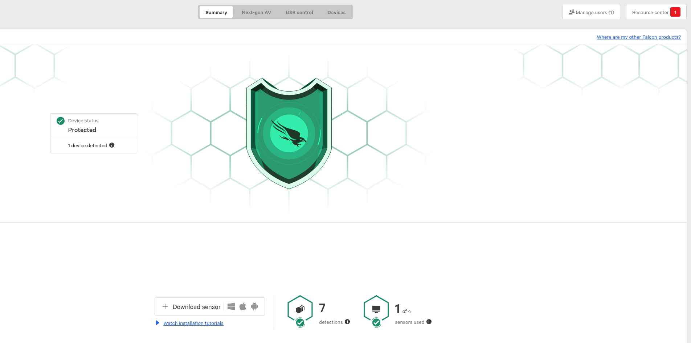
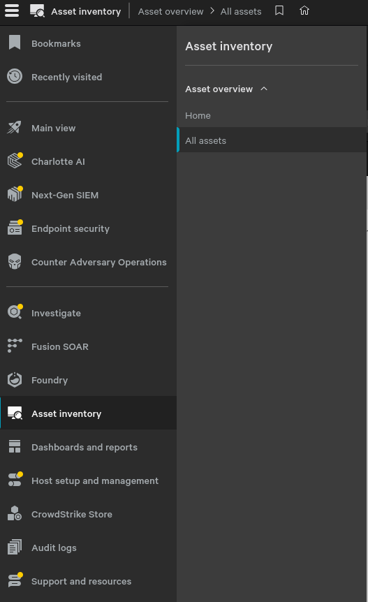
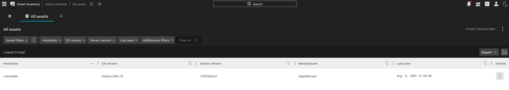
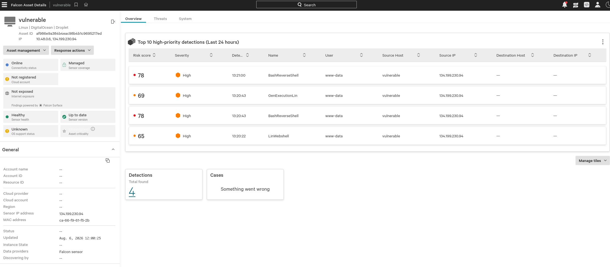
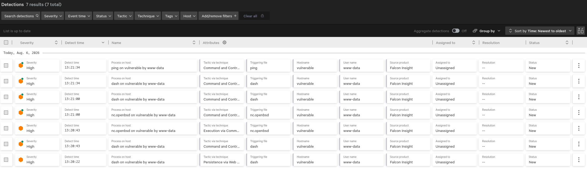
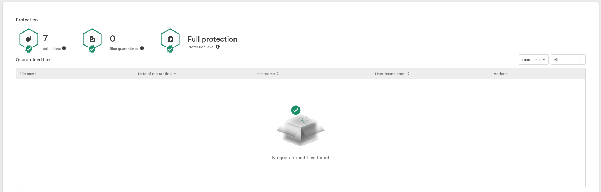
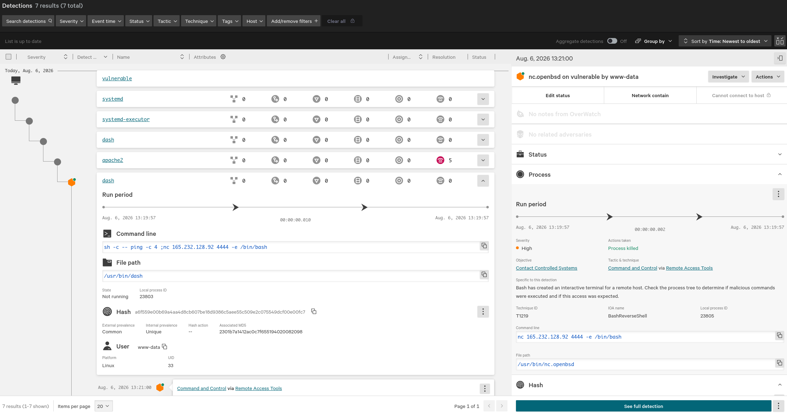
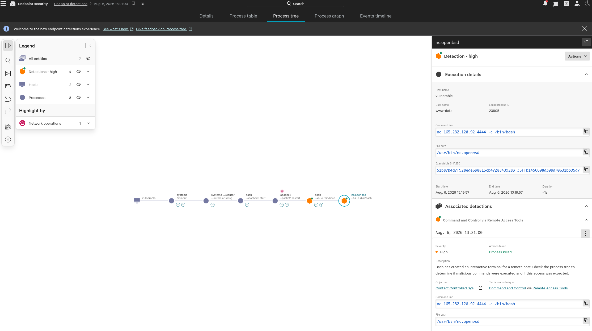

# CrowdStrike Falcon

Alright, so let's talk about CrowdStrike and why Endpoint Detection and Response, or EDR, is important.
Generally speaking, you have a few points of observability for any given operating system:
* Files
* Logs
* Network Traffic
* Syscalls and Running Processes

This syscalls and running processes is the bread and butter of EDR.
The way this works is in two parts, a server providing alerting and interactivity for investigations, and an agent installed on the protected system.

The agent works in one of two ways, depending on operating system. It will either be a series of kernel hooks that intercept various system calls and generally watches what the kernel is doing, or it will be a series of extended Berkeley Packet Filter, or eBPF, programs.
Now, this differentiation is implementation detail. The goal is the same, intercepting syscalls and the like for analysis. An eBPF program is just a safer way to perform kernel hooking available on linux kernels.
If a kernel hook crashes, so does the whole OS. If an eBPF program crashes, the OS keeps on churning.
Funnily enough, this is why you won't see a similar incident to the 2023 CrowdStrike Fiasco happening on linux like it did on windows.
I got to be the incident commander for that one. Good times.

Let's talk about CrowdStrike specifically, the golden standard of EDR.

## Methodology
To show you this, I setup an attack box and a vulnerable box.
The attack box doesn't matter.
The vulnerable box is running the latest CrowdStrike Falcon sensor.
It also has DVWA installed.
To generate these detections, I performed command injection attacks against DVWA; nothing a fresh-out-of-pentesting-101 hacker wouldn't try.
Of course, these attempts generated both a detection and a response (in the form of the process being killed).

## Logging in
Once you log in, you're presented with a dashboard:

Here, you can see I have 1 of 4 sensors used and 7 detections but otherwise CS considers my hosts 'Protected'.

## Menu
Clicking on the menu, you see all kinds of options, many of which I don't have available or am not interested in.

## Asset Inventory
Since CrowdStrike is designed to be run on most, if not all, of your hosts, it builds a nice asset inventory for you.
Maybe compare it to your own asset inventory and find anything missing?

## Detections
Alright, so back to it, earlier, you saw I had 7 detections, so let's look at them in endpoint security.

We can also look at all detections.

And we can even see that nothing's been quarantined (different dashboard)

## Investigating
Then we can drill down into an individual detection directly from the all detections page.

We can see the full process tree, showing parent/child relationships between processes that lead to the detection being triggered.
We can see the user running the process, the image file path for it, the hash of it, the command line, all kinds of useful info.

If we click on "See full detection" in the bottom right corner, we're taken to a page showing a lot of the same information but in a cleaner and more interactive way.

## Conclusion
As you can see, just having that protection, CrowdStrike Falcon installed and running, and then that basic understanding of what information is available to you during an incident can go a long way.

EDR isn't a technology that can be ignored, by defenders or attackers, and as a defender, failing to have an agent like CrowdStrike Falcon installed is the difference between simple command injection leading to ransomware, data leaks, loss of reputation, etc and a simple deny, alert, and patch routine.
